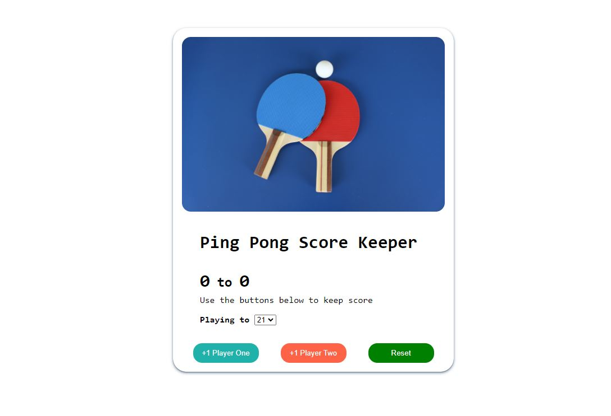

# Ping-Pong-Score-Keeper

This is a solution to the Ping Pong Score Keeper for the [The Web Developer Bootcamp 2022](https://www.udemy.com/course/the-web-developer-bootcamp/).

## Table of contents

- [Ping-Pong-Score-Keeper](#ping---pong---score---keeper)
  - [Table of contents](#table-of-contents)
  - [Overview](#overview)
    - [The challenge](#the-challenge)
    - [Screenshot](#screenshot)
    - [Links](#links)
    - [Built with](#built-with)
    - [What I learned](#what-i-learned)
    - [Continued development](#continued-development)
  - [Author](#author)
  
  ## Overview

### The challenge

Users should be able to:

- View the optimal layout for the site depending on their device's screen size
- See hover states for all interactive elements on the page
- Change the winning score while match still in progress.
- Reset scoreboard

### Screenshot

### Links

- Live Site URL: [Github Pages](https://brukkk.github.io/Ping-Pong-Score-Keeper/)

### Built with

- Semantic HTML5 markup
- CSS 
- Flexbox
- CSS Grid
- Javascript Events

### What I learned

Implementing 2 types of event listeners helped me understand why web pages may have a different behavior on desktop and smart devices.

### Continued development

- [x] Desktop website
- [x] Responsive mobile
- [x] Add-buttons and reset score
- [x] Animation when match ends
- [ ] Editing score
- [ ] Keep playing if it's decided to prolong the match to a higher score

## Author

- Portfolio - [Bruk](https://brukkk.github.io/bruk/)
- Twitter - [BruksT](https://twitter.com/BruksT)
